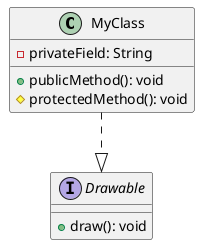

# PlantUML Quick Reference

## Common Commands

```bash
# Generate PNG
plantuml -Tpng diagram.puml -o diagram.png

# Generate SVG (preferred for web)
plantuml -Tsvg diagram.puml -o diagram.svg

# Render all .puml files in directory
for f in *.puml; do plantuml -Tsvg "$f"; done
```

## Template Files

Located in `.claude/skills/plantuml/templates/`:

- **class_diagram_example.puml** — OOP structure, data models
- **usecase_diagram_example.puml** — System boundaries, user interactions
- **sequence_diagram_example.puml** — Message flows, process steps

Copy and modify for your needs.

## Relationship Symbols

| Symbol | Meaning |
|--------|---------|
| `<\|--` | Inheritance (extends) |
| `<\|..` | Interface implementation |
| `--` | Association |
| `o--` | Aggregation (has-a) |
| `*--` | Composition (owns) |
| `-->` | Directed association |

## Quick Syntax



## File Organization

```
docs/
├── diagrams/
│   ├── architecture.puml      (source)
│   ├── architecture.svg       (rendered)
│   ├── usecase.puml
│   ├── usecase.svg
│   └── ...
└── README.md                  (links to diagrams)
```

## Next Steps

1. Choose your diagram type (class, use-case, sequence, state)
2. Copy a template from `templates/`
3. Modify for your system
4. Render: `plantuml -Tsvg your_diagram.puml`
5. Embed in documentation

---

See SKILL.md for full documentation and more examples.
