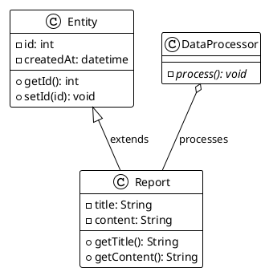
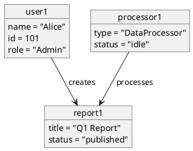
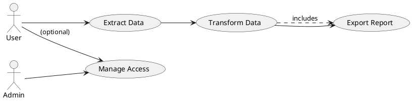
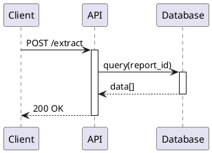
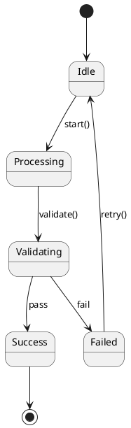
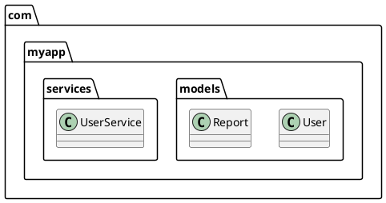
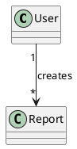

# PlantUML Skill

Professional diagram generation for software architecture, data models, workflows, and system design. PlantUML converts plain-text specifications into publication-quality UML diagrams.

## Quick Start

### 1. Choose Diagram Type
- **Class Diagram**: Object-oriented structure, relationships, inheritance
- **Object Diagram**: Runtime instances and relationships
- **Use-Case Diagram**: System boundaries, actors, interactions
- **Sequence Diagram**: Message flows and interactions over time
- **State Diagram**: State machines and transitions
- **Deployment Diagram**: Infrastructure and deployment

### 2. Write PlantUML Code
Create a `.puml` file with your diagram definition.

### 3. Render
```bash
plantuml -Tpng diagram.puml -o output.png
plantuml -Tsvg diagram.puml -o output.svg
```

---

## Diagram Templates

### Class Diagram
Best for: OOP architecture, data models, API design



**Key symbols**:
- `-` private, `+` public, `#` protected, `~` package
- `<|--` inheritance
- `--` association
- `o--` aggregation
- `*--` composition
- `<|..` interface implementation

### Object Diagram
Best for: Runtime instances, concrete states, relationships



### Use-Case Diagram
Best for: System boundaries, user interactions, feature scope



**Relationships**:
- `-->` basic association
- `.>` extends
- `--|>` includes

### Sequence Diagram
Best for: Message flows, interactions, API calls



### State Diagram
Best for: Workflows, state machines, process flows



---

## Workflow: From Code to Diagram

### Step 1: Analyze Architecture
Read the codebase, identify classes, relationships, responsibilities.

### Step 2: Create `.puml` File
```bash
mkdir -p docs/diagrams
touch docs/diagrams/architecture.puml
```

### Step 3: Write PlantUML Syntax
Document your design in plain text.

### Step 4: Render
```bash
plantuml -Tsvg docs/diagrams/architecture.puml -o docs/diagrams/architecture.svg
```

### Step 5: Embed in Documentation
Link diagrams in `README.md` or documentation files:
```markdown
## Architecture


```

---

## PlantUML Features

### Styling

```plantuml
@startuml
skinparam backgroundColor #FEFEFE
skinparam classBackgroundColor #F0F0F0
skinparam classBorderColor #333333

class MyClass {
  data: String
}
@enduml
```


### Namespaces


### Multiplicity


---

## Rendering Options

```bash
# PNG (raster, smaller file)
plantuml -Tpng file.puml -o output.png

# SVG (vector, scalable, interactive)
plantuml -Tsvg file.puml -o output.svg

# PDF
plantuml -Tpdf file.puml -o output.pdf

# ASCII art (terminal)
plantuml -Ttxt file.puml -o output.txt

# Batch render all diagrams
for f in *.puml; do plantuml -Tsvg "$f"; done
```

---

## Best Practices

✅ **DO**:
- Keep diagrams focused (one responsibility per diagram)
- Use consistent naming conventions
- Include legends or notes for complex diagrams
- Version control `.puml` files (small, text-based)
- Embed diagrams in documentation

❌ **DON'T**:
- Create monolithic diagrams showing everything
- Forget to document what the diagram represents
- Use confusing color schemes
- Commit rendered images without source `.puml`

---

## Common Tasks

### Task: Generate class diagram for Python module
1. Read Python source files
2. Extract classes, methods, relationships
3. Create `.puml` with class definitions
4. Render to `docs/diagrams/`

### Task: Create use-case diagram from requirements
1. Identify actors (User, Admin, External System)
2. List use cases (what the system does)
3. Draw relationships and boundaries
4. Render for stakeholder review

### Task: Document data model
1. Identify entities and fields
2. Define relationships (1:1, 1:N, M:N)
3. Create class diagram with attributes
4. Render as architecture reference

---

## Integration with OOP Expert

Use PlantUML skill alongside `/oop-expert` agent:
1. **oop-expert reviews** your architecture
2. **plantuml skill generates** diagrams
3. **Both contribute** to documentation and validation

---

## Resources

- **Official**: https://plantuml.com/
- **Syntax Guide**: https://plantuml.com/guide
- **Real-world Examples**: https://plantuml.com/en/example

---

You're ready to create professional UML diagrams for documentation and architecture communication.
